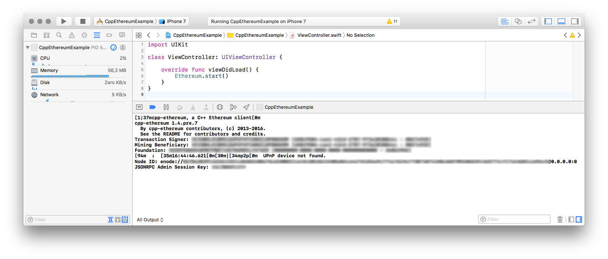

Ethereum for iOS
================

Unofficial port of [C++ Ethereum][1] to iOS.

### This project is no longer maintained

We have stopped working on this project when the news broke that the C++ Ethereum developers were [unable to relicense the code](http://www.ibtimes.co.uk/hyperledger-project-reflects-blockchain-politics-1603381). This means that C++ Ethereum is only available through the GPLv3 license, which is incompatible with Apple's App Store. In other words: you can not make an app that includes C++ Ethereum an put it in the app store.

### Limitations

Do not expect a fully functional Ethereum client on iOS.

Known limitations:

* C++ Ethereum is currently GPLv3 licensed, which is [incompatible][5] with Apple’s terms for the App Store.
* C++ Ethereum will download the whole blockchain, which is probably not a good idea on a mobile device. Light client support [is planned][7] but not yet available.
* It will report connection errors with all peers when run on the simulator.
* It crashes immediately when run on a real device because it cannot write to the .ethereum directory.

### Prerequisites
* Xcode 8
* [CocoaPods][2]

### Installation

Add the cpp-ethereum-ios CocoaPods repository to your Podfile:

    source 'https://github.com/cpp-ethereum-ios/podspecs'
    source 'https://github.com/CocoaPods/Specs.git'

You can then add a dependency on the cpp-ethereum pod:

    pod 'cpp-ethereum', '~> 1.4.pre'

By running `pod update` you can download C++ ethereum and its dependencies. This can take a long time because many dependencies are being compiled.

Please note that you cannot use frameworks currently. So please leave out the `use_frameworks!` statement from your Podfile.

### API

You can invoke the eth_main method from C++. It takes the same command line options as the ‘eth’ binary. For example:

    extern int eth_main(int argc, char** argv);
    eth_main(0, NULL);

You should then be able to connect to the JSON-RPC port, which gives you access to the [rest of the API][4].

### Example

[An example project][3] is available that shows how to integrate the library and call the C++ code from Swift.

[1]: http://cpp-ethereum.org/
[2]: https://cocoapods.org
[3]: https://github.com/cpp-ethereum-ios/cpp-ethereum-ios-example
[4]: https://github.com/ethereum/wiki/wiki/JSON-RPC
[5]: https://www.fsf.org/news/2010-05-app-store-compliance/
[6]: https://bobsummerwill.com/2016/07/12/c-re-licensing-plan/
[7]: https://github.com/ethereum/cpp-ethereum/issues/3101
